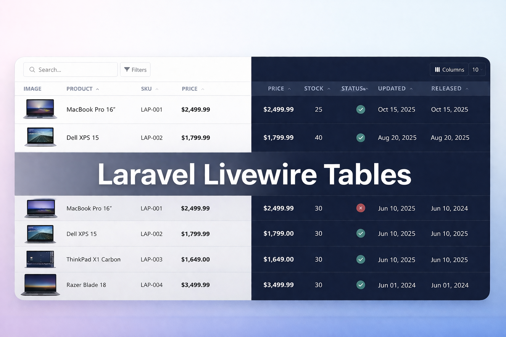

# Laravel Livewire Tables

<p align="center">
    <picture>
        
    </picture>
</p>

<p align="center">
    <a href="https://github.com/alp-develop/laravel-livewire-tables/actions/workflows/tests.yml"></a>
    <a href="https://packagist.org/packages/alp-develop/laravel-livewire-tables"></a>
    <a href="https://packagist.org/packages/alp-develop/laravel-livewire-tables"></a>
</p>

> Full-featured, reactive data tables for Laravel. Search, sort, filter, paginate, export, bulk actions — zero JavaScript.

**Laravel** 10–13 | **Livewire** 3–4 | **PHP** 8.1–8.5 | **Tailwind** / **Bootstrap 5** / **Bootstrap 4** | Dark mode

---

## Install

### 1. Require the package

```bash
composer require alp-develop/laravel-livewire-tables
```

### 2. Publish and configure

```bash
php artisan vendor:publish --tag=livewire-tables-config
```

This creates `config/livewire-tables.php`. **This step is required** — the config defines the theme, colors, dark mode, and other essential settings.

### 3. Themes

Set the theme in `config/livewire-tables.php`:

```php
'theme' => 'tailwind',
```

| Theme | Value | Alias |
|-------|-------|-------|
| Tailwind CSS | `tailwind` | — |
| Bootstrap 5 | `bootstrap-5` | `bootstrap5`, `bootstrap` |
| Bootstrap 4 | `bootstrap-4` | `bootstrap4` |

### 4. Tailwind only

Add to your CSS: `[x-cloak] { display: none !important; }`

## Quick Start

```bash
php artisan make:livewiretable UsersTable User
```

```php
<?php

namespace App\Livewire\Tables;

use App\Models\User;
use Illuminate\Database\Eloquent\Builder;
use Livewire\Tables\Columns\TextColumn;
use Livewire\Tables\Columns\BooleanColumn;
use Livewire\Tables\Columns\ActionColumn;
use Livewire\Tables\Filters\SelectFilter;
use Livewire\Tables\Livewire\DataTableComponent;

class UsersTable extends DataTableComponent
{
    public function configure(): void
    {
        $this->setDefaultPerPage(25);
        $this->setSearchDebounce(300);
    }

    public function query(): Builder
    {
        return User::query();
    }

    public function columns(): array
    {
        return [
            TextColumn::make('name')->sortable()->searchable(),
            TextColumn::make('email')->sortable()->searchable(),
            BooleanColumn::make('active')->sortable(),
            TextColumn::make('created_at')
                ->label('Joined')->sortable()
                ->format(fn ($value) => $value?
                ->format('M d, Y')),
            ActionColumn::make()
                ->button('Edit', fn ($row) => "edit({$row->id})", 'lt-btn-primary')
                ->button('Delete', fn ($row) => "delete({$row->id})", 'lt-btn-primary'),
        ];
    }

    public function filters(): array
    {
        return [
            SelectFilter::make('active')
                ->label('Status')
                ->setOptions(['' => 'All', '1' => 'Active', '0' => 'Inactive'])
                ->filter(fn (Builder $q, $v) => $q->where('active', (bool) $v)),
        ];
    }

    public function bulkActions(): array
    {
        return [
            'deleteSelected' => 'Delete Selected',
            'exportCsvAuto'  => 'Export CSV',
        ];
    }

    public function deleteSelected(): void
    {
        User::whereIn('id', $this->getSelectedIds())->delete();
    }

    public function edit(int $id): void
    {
        $this->redirect(route('users.edit', $id));
    }

    public function delete(int $id): void
    {
        User::findOrFail($id)->delete();
    }
}
```

```blade
<livewire:tables.users-table />
```

## Multiple Tables in the Same View

When rendering **multiple instances** of the same table component (or different tables that share the same class), assign a unique `table-key` to each one so their state (filters, search, sorting, pagination) is isolated:

```blade
<livewire:tables.users-table table-key="users-active" />
<livewire:tables.users-table table-key="users-archived" />
```

You can also pass it dynamically:

```blade
<livewire:tables.users-table :table-key="'users-' . $section" :table-theme="$theme" />
```

> If you don't set `table-key`, all instances of the same component will share state via session.

## Documentation

| Guide | |
|-------|---|
| [Installation](docs/installation.md) | Setup, config, publishing assets |
| [Configuration](docs/configuration.md) | Config reference, per-table options, table key |
| [Columns](docs/columns.md) | Text, Boolean, Date, Image, Action, Blade |
| [Filters](docs/filters.md) | All types, dependent filters, custom logic |
| [Bulk Actions](docs/bulk-actions.md) | Selection model, custom actions, CSV export |
| [Export](docs/export.md) | Auto CSV, custom exports |
| [Events & Hooks](docs/events.md) | Lifecycle hooks, external refresh |
| [Toolbar Slots](docs/toolbar-slots.md) | 6 hook points for custom content |
| [Theming](docs/theming.md) | Themes, dark mode, color palette |
| [Dark Mode](docs/dark-mode.md) | `.lt-dark` class, session detection, `$this->darkMode` |
| [Joins](docs/joins.md) | Joined columns, aliases, search on joins |
| [Security](docs/security.md) | Built-in protections, safe callbacks |

## Development

```bash
composer test       # Run tests
composer analyse    # PHPStan level 8
composer format     # Pint code style
```

[Contributing](CONTRIBUTING.md) · [Changelog](CHANGELOG.md) · [License](LICENSE)
